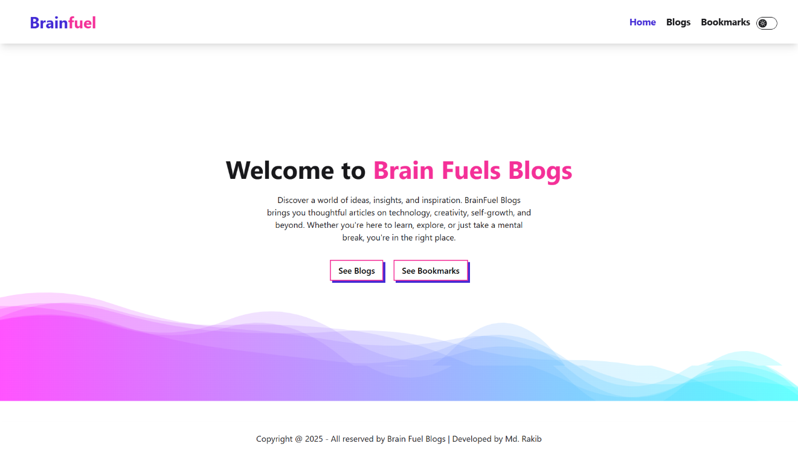
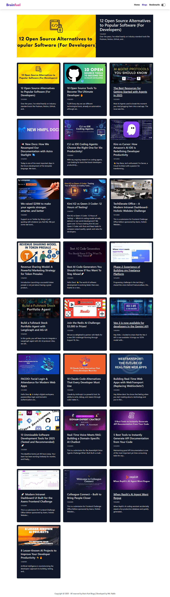

# ​ BrainFuel Blogs

A sleek, modern blogging platform crafted with **React.js**, featuring a clean UI, intuitive navigation, and thoughtful user experience.

##  Live Demo
Check it out here: [Live Demo](https://brain-fuel-blog-website.vercel.app/)

##  Features
- Blog listing & detailed view with images and author info  
- Bookmarking system (powered by LocalStorage)  
- Light/Dark mode toggle  
- Fully responsive with polished UI  

##  Tech Stack
- React.js  
- Tailwind CSS + daisyUI  
- React Router  
- LocalStorage  

##  Screenshots
  
  

##  Installation & Usage
```bash
# 1. Clone the repository
git clone https://github.com/yourusername/brainfuel-blogs.git

# 2. Navigate into the project
cd brainfuel-blogs

# 3. Install dependencies
npm install

# 4. Start the development server
npm start
